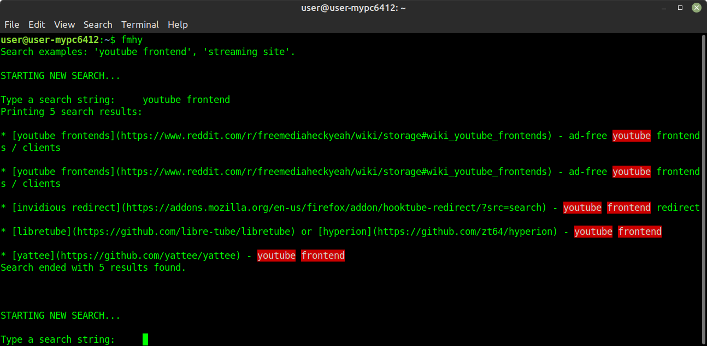

# A basic search engine for [FMHY](https://fmhy.tk/) (a Python script)
*A bit better than doing <Ctrl+F> on its [single-page export file](https://raw.githubusercontent.com/nbats/FMHYedit/main/single-page) from [its github repo](https://github.com/nbats/FMHYedit)*

It looks like this:


## Installation / Requirements
Script to be executed with [Python](https://www.python.org/)

You could 
- install Python on your PC or 
- execute it on a site like [this one](https://www.programiz.com/python-programming/online-compiler/) (copy-paste the code in the file fmhy-search.py and lick 'Run')

Neccesary package: (most likely already installed with python)
```
pip install request
```
Optional package (required to see the coloring on the search terms):
```
pip install termcolor
```
