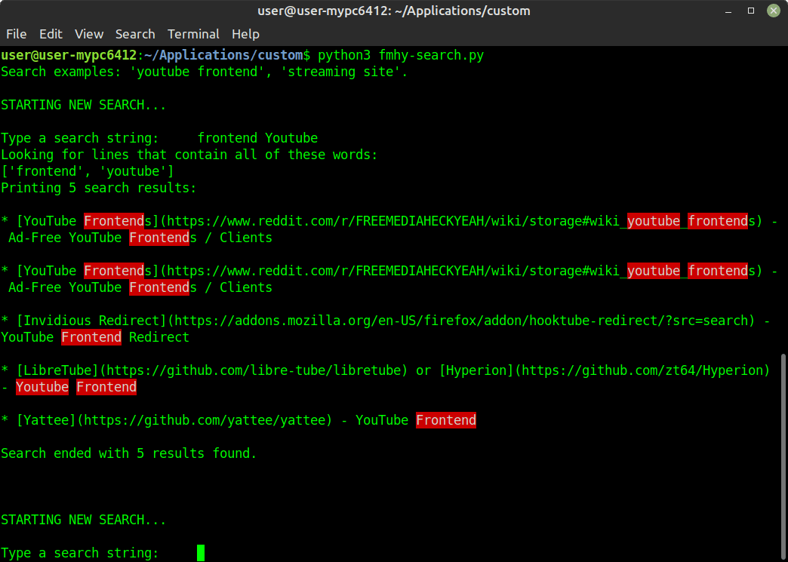

# A basic search engine for [FMHY](https://www.reddit.com/r/FREEMEDIAHECKYEAH/) (a Python script)
*In some cases a bit better than doing <Ctrl+F> on its [single-page export file](https://raw.githubusercontent.com/nbats/FMHYedit/main/single-page) from [its Github repo](https://github.com/nbats/FMHYedit)*

It looks like this:



## How to get it working
### Requirements
1) You need to have [Python](https://www.python.org/) installed. (When installing on Windows, check "Add to PATH" so that you can easily use the pip command)

2) You need to install some Python packages. To check if they are installed, and install the missing ones, type/paste this in the terminal/command-prompt:
```
pip install requests termcolor colorama
```
### Usage
Now you can execute the script. Depending on the OS you are in:
- If on Windows, the easiest way is to right click on the script (which is the file "fmhy-search.py") and "Open with" Python.

- If on Linux, type on the terminal:
```
python3 /<route>/fmhy-search.py
```

- If on Mac or anything with Python installed, it works too, but I'm not sure what are the exact steps.
